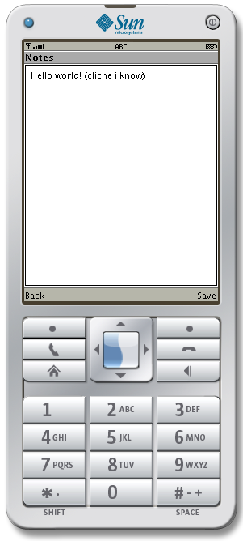

Esotext  
===
Esotext is a very simple encrypted note taking app for J2ME devices. It targets MIDP 2.0, CLDC 1.1. It encrypts notes using AES256 in IGE mode, with encryption keys being the SHA256 hash of your password. This application expects you to have a memory card on your phone, or some other storage device that can be written to by uncertified applications. Encrypted notes are stored in the file `esotext.etxt`.

[Download the JAR file here](bin/Esotext.jar).

This has only been tested on a Nokia C2-01 and the Java Wireless Toolkit Emulator. J2ME is notorious for having device specific differences in file systems so let me know if it doesn't work on your phone.

Useful links
--
 - [CLDC 1.1 reference](https://docs.oracle.com/javame/config/cldc/ref-impl/cldc1.1/jsr139/)  
 - [MIDP 2.0 reference](https://docs.oracle.com/javame/config/cldc/ref-impl/midp2.0/jsr118/)

Building
--
This project can be built using the Sun Java Wireless Toolkit, which you can install on Ubuntu by following this [StackOverflow answer](https://stackoverflow.com/a/60260530/5269447). Once installed you should copy this repository to your j2mewtk folder (default is `~/j2mewtk`) under `2.5.2/apps/` and you should see it when you go to 'open project'. Then you can click `build` then `run`.  

Troubleshooting WTK
--
 - If the emulator comes up with a white screen restart your computer, I think there's some weird conflict with Docker, so launching docker at any point during a session means you'll need to restart your computer.
 - Additional emulator instances may randomly appear when running, just get used to ignoring or closing them, it's a bug with ktoolbar.

FAQs
--

 - Q:Why did you make this?
 - A: 

 - Q: IGE mode is cringe use a real encryption mode!
 - A: That's not a question and no I already wrote an implementation of an AES mode for my unfinished Telegram client I'm not doing another one

 - Q: Why are you writing code for a platform this old?
 - A: I unironically use it because new phones are kind of just massive, annoying and want to force services down your throat. Not sure what I'm gonna do when le globalists get rid of 3G, but after we get nuked it'll be pretty hard to maintain any sort of mobile infrastructure anyway so I guess it might just not end up being a problem
